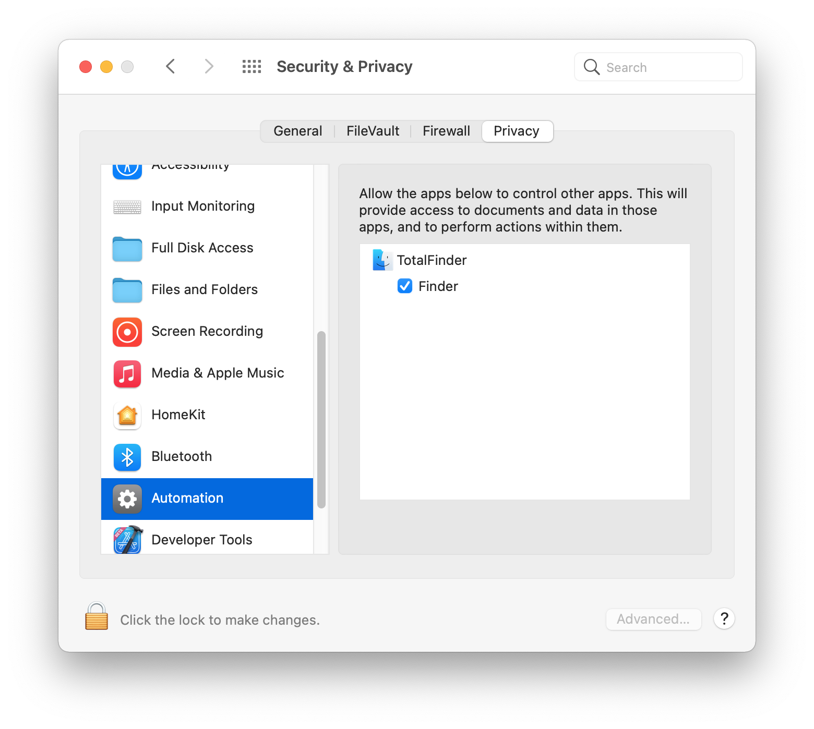

This feature is implemented since TotalFinder 1.13.7.

During startup, TotalFinder can sometimes detect that it does not have correct permissions to control Finder: 

Normally when you go to `System Preferences > Security & Privacy > Privacy > Automation` you should see
something like this:

Either you or someone else unchecked it. Or TotalFinder lost the permission for some other reason. 
Or TotalFinder was never given this permission in the first place. 
Anyway, please consider enabling it and then hit `Continue` on the "Automation Permissions" prompt.

### Don't see it under Automation?

Ah, too bad. You might be experiencing a bug which causes this permission to be missing in the UI. 

Please [continue with this article](/injection-troubles).