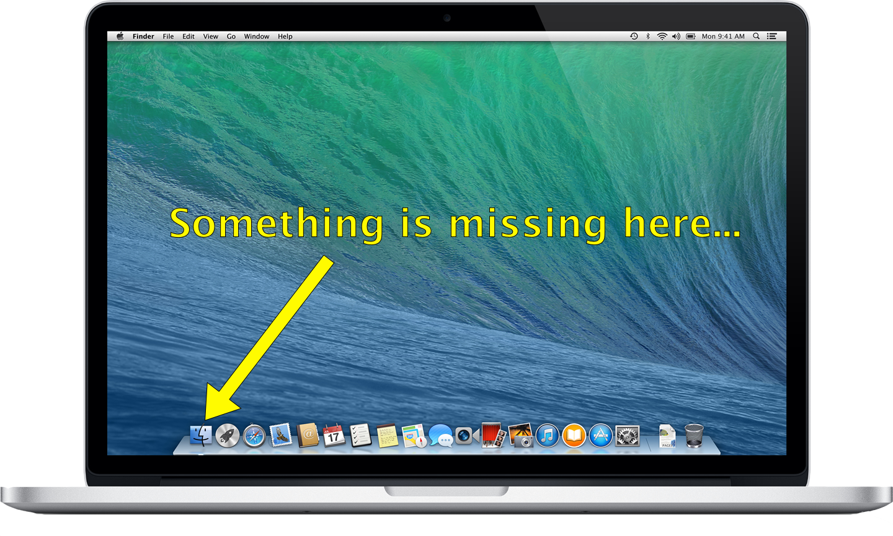

**Good news!** We plan to bring all existing TotalFinder features to Mavericks. Including chrome-style tabs. It is too early to say if it all will be feasible, but we are pretty optimistic that it will be technically possible. Until official Mavericks release in fall 2013 we have still some time to discover possible ways how to do that.

As of [version 1.4.15](http://totalfinder.binaryage.com/beta-changes), TotalFinder launches without errors under OS X 10.9, but most features are disabled for now. We will re-enable them one by one as we will progress porting the code to the new system.

We will also support Lion and Mountain Lion versions in foreseeable future. We might decide to drop Lion (10.7) support in January 2014.

---

## Beta testing

Please subscribe to beta channel of TotalFinder updates: 
[http://totalfinder.binaryage.com/beta-changes](http://totalfinder.binaryage.com/beta-changes)

Please report bugs and compatibility issues here: [http://getsatisfaction.com/binaryage](http://getsatisfaction.com/binaryage).

**Thanks, you are awesome!**